# fala-ai-social_network_graph

# 🗣️ Fala Ai - Análise de Rede Social com Neo4j


[](https://neo4j.com/)
[](https://neo4j.com/developer/cypher/)
[](https://www.docker.com/)
[](https://neo4j.com/docs/graph-data-science/)
[](https://www.python.org/)
[](https://gemini.google.com/app)
[](https://www.deepseek.com/en/)


## 👍 Sobre mim

Sou o **Álvaro Monteiro**, entusiatas de IA e agora de banco em grafo. Aluno aqui da DIO.me, que é fantástica.

Quero compartilhar com voces este projeto de analise e redes socias

Foi bem desafiador, pois tudo aqui no Neo4J e novo, porém desafio dado é dessafio cumprido (kkk)

Espero que gostem da abordagem que fiz sobre o projeto, e sendo possivel podem enviar comentários sugestões ou até fazer um fork do projeto e dar continuidade fiquem a vontade.

Forte abraço, espero que gostem!

## 📋 Sobre o Projeto

**Fala Ai** é uma plataforma de análise de redes sociais que utiliza grafos para mapear interações entre usuários, identificar comunidades e gerar insights sobre engajamento. Este projeto implementa um protótipo funcional de banco de dados em grafo para uma rede social similar ao X e Instagram, permitindo responder perguntas complexas sobre:

- **Estrutura social**: Quem segue quem, quem curte o quê, quem posta para quem
- **Comunidades**: Identificação de grupos com interesses similares
- **Engajamento**: Análise de popularidade e influência
- **Recomendações**: Sugestões de conexões baseadas em similaridade

### 🎯 Objetivos do Negócio

1. **Analisar o público-alvo** de grupos e comunidades
2. **Encontrar o caminho mais curto** entre usuários
3. **Calcular a menor distância social** entre pessoas
4. **Recomendar novos seguidores** baseado em:
   - Interesses similares (posts curtidos)
   - Demografia (idade, sexo, localização)
   - Amigos em comum

### Grafo do projeto

**Visão Pessoa x Comunidade**

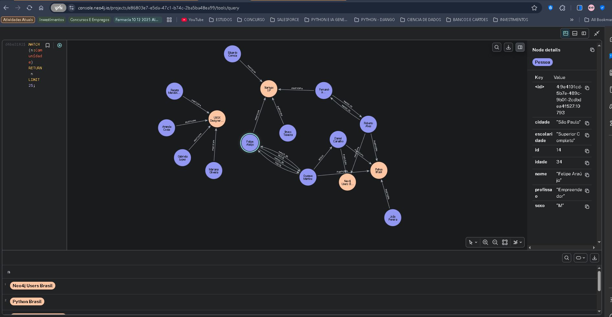

**Outra visão -> Visão Pessoa x Grupos**

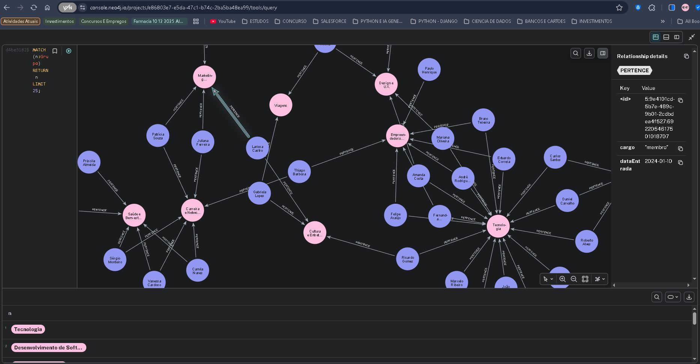

**Outra visão -> Visão Pessoa x Post**

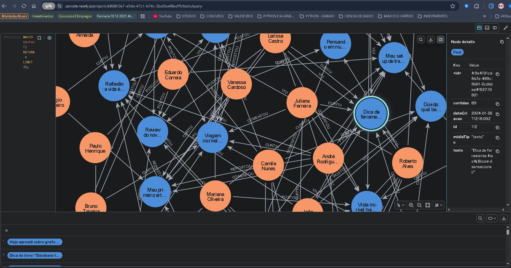


### 🧠 Por que Grafos?

| Problema | Abordagem Tradicional (SQL) | Abordagem em Grafo (Neo4j) |
|----------|----------------------------|----------------------------|
| "Amigos em comum" | Múltiplos JOINs complexos | Simples path matching |
| "Caminho mais curto" | Recursões pesadas | Algoritmos nativos |
| "Comunidades" | Análise estatística offline | Algoritmos de comunidade in-database |
| "Similaridade" | Cálculo externo | Node Similarity Algorithm |

## 📊 Modelo de Dados

### Nós (Labels)

| Label | Descrição | Propriedades Principais |
|-------|-----------|-------------------------|
| `Pessoa` | Usuário da plataforma | `id`, `nome`, `idade`, `sexo`, `cidade`, `escolaridade`, `profissao` |
| `Post` | Conteúdo publicado | `id`, `texto`, `dataCriacao`, `midiaTipo`, `curtidas` |
| `Grupo` | Comunidade temática | `id`, `nome`, `descricao`, `categoria` |
| `Comunidade` | Subgrupo dentro de grupos | `id`, `nome`, `tipo` |

### Relacionamentos

| Relacionamento | Direção | Propriedades | Significado |
|----------------|---------|--------------|-------------|
| `SEGUE` | (Pessoa)→(Pessoa) | `dataInicio` | Segue outro usuário |
| `E_SEGUIDO` | (Pessoa)←(Pessoa) | `dataInicio` | É seguido por alguém |
| `POSTOU` | (Pessoa)→(Post) | `dataHora` | Publicou um post |
| `CURTIU` | (Pessoa)→(Post) | `dataHora`, `dispositivo` | Curte um post |
| `COMENTOU` | (Pessoa)→(Post) | `texto`, `dataHora` | Comenta em um post |
| `VIU` | (Pessoa)→(Post) | `dataHora`, `duracao` | Visualizou um post |
| `REPOSTOU` | (Pessoa)→(Post) | `dataHora`, `comentario` | Compartilhou um post |
| `PERTENCE` | (Pessoa)→(Grupo) | `dataEntrada`, `cargo` | Membro de um grupo |
| `PARTICIPA` | (Pessoa)→(Comunidade) | `dataEntrada`, `nivelAtividade` | Participa de uma comunidade |
| `AMIGO_DE` | (Pessoa)-(Pessoa) | `dataAmizade` | Amizade mútua |

### Diagrama do Modelo


*(Modelagem criada com [Arrows.app](https://arrows.app/))*

## 🚀 Configuração e Execução

### Pré-requisitos

- Neo4j (versão 5.x ou superior) - [Download](https://neo4j.com/download/)
- Plugins: APOC e Graph Data Science (GDS)
- Navegador moderno para visualização

### **Opção de Execucação**

- **Opcional usar o VsCode para criar o seu ambiente.**
- Instalar o Docker desktop
- Instalar se for Windows o WSL
- Instalar o docker
- Docker com esta configuração.

    docker run \
        --name neo4j-fala-ai-Local \
        -p 7474:7474 \
        -p 7687:7687 \
        -e NEO4J_AUTH=neo4j/falaai123 \
        -e NEO4J_PLUGINS='["graph-data-science", "apoc"]' \
        -d \
        neo4j:5.23
 
 **Instalação do Neo4J local via Docker**

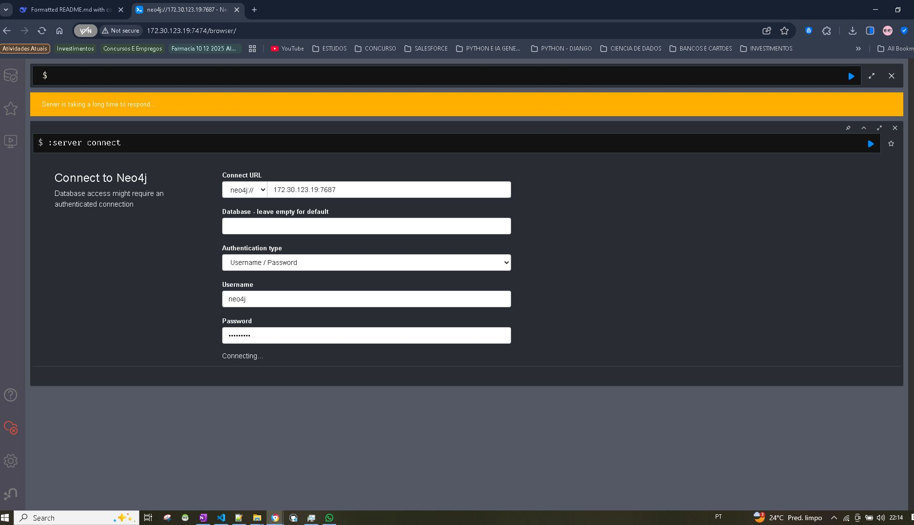

### Passo a Passo

1. **Clone o repositório**
   ```bash

   git clone https://github.com/[seu-usuario]/fala-ai-graph.git
   cd fala-ai-graph 
   ```
   
2. **Inicie o Neo4j AuraDB web ou desktop, caso tenha usado o docker, acesse o Browser (geralmente http://localhost:7474)**

3. **Execute os scripts na ordem correta:**

   ```bash

    scripts/01_criacao_banco.cypher - Cria constraints e índices e Popula o banco com dados de exemplo

    scripts/02_analise_queries.cypher - Analise de plano de acesso de algumas querys utilizadas.

    scripts/03_analises_completas.cypher - Executa as análises   - Execute consulta a consulta para poder ver o resultado
   ```

---

## 🔍 Queries de Negócio e Análises

### 1. Cypher Implicit Aggregations

Objetivo: Analisar distribuições agregadas de forma simples.

```
	cypher
	// Distribuição de usuários por faixa etária
	MATCH (p:Pessoa)
	RETURN 
	    CASE 
	        WHEN p.idade < 18 THEN '0-17'
            WHEN p.idade < 30 THEN '18-29'
	        WHEN p.idade < 50 THEN '30-49'
	        ELSE '50+'
	    END AS faixa_etaria,
	    count(*) AS total_usuarios
	ORDER BY total_usuarios DESC;
```

**Resultado:**

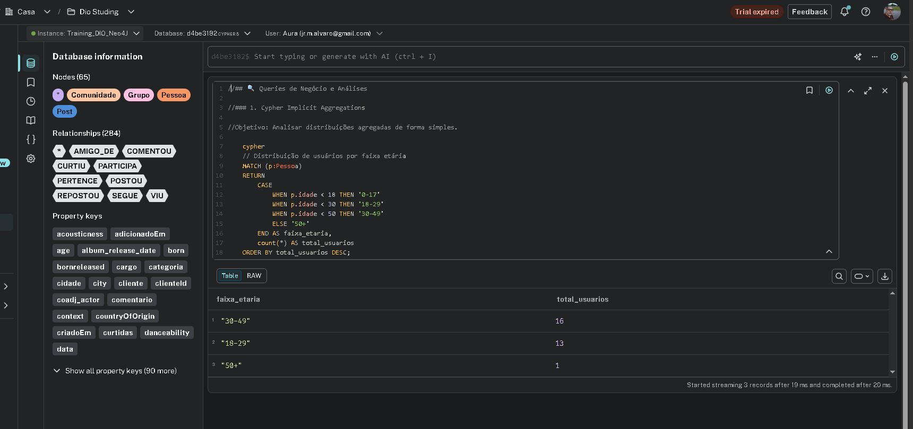

**Resultado esperado**: Permite identificar o público-alvo predominante na plataforma.

### 2. Node Degree Distribution

Objetivo: Analisar a distribuição de conexões para identificar usuários influentes.

```
cypher

// Distribuição de seguidores (in-degree)

MATCH (p:Pessoa)
WITH p, count{ (p)<-[:SEGUE]-() } AS seguidores
RETURN 
    CASE 
        WHEN seguidores = 0 THEN '0'
        WHEN seguidores <= 10 THEN '1-10'
        WHEN seguidores <= 100 THEN '11-100'
        WHEN seguidores <= 1000 THEN '101-1000'
        ELSE '1000+'
    END AS faixa_seguidores,
    count(*) AS total_pessoas
ORDER BY faixa_seguidores;
```

**Resultado:**
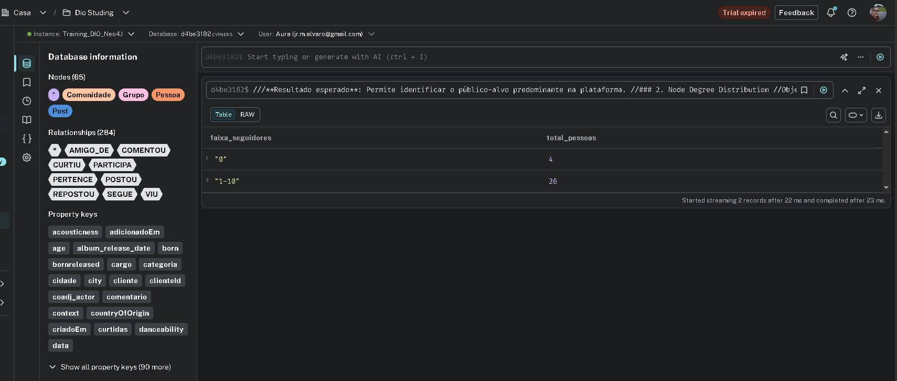

```
// Estatísticas da distribuição usando APOC

MATCH (p:Pessoa)
WITH count{ (p)<-[:SEGUE]-() } AS seguidores
RETURN apoc.agg.statistics(seguidores) AS estatisticas;

```
- **Insight: Identifica a concentração de seguidores - normalmente uma distribuição power-law (poucos influenciadores, muitos com poucos seguidores).**


### 3. Weakly Connected Components (WCC)

Objetivo: Identificar componentes isolados na rede social.

**3.1. Projetar o grafo para o GDS**

``` 
cypher

CALL gds.graph.project(
    'fala-ai-graph',
    'Pessoa',
    {
        SEGUE: { type: 'SEGUE', orientation: 'UNDIRECTED' },
        AMIGO_DE: { type: 'AMIGO_DE', orientation: 'UNDIRECTED' }
    }
);
```
**Resultado:**

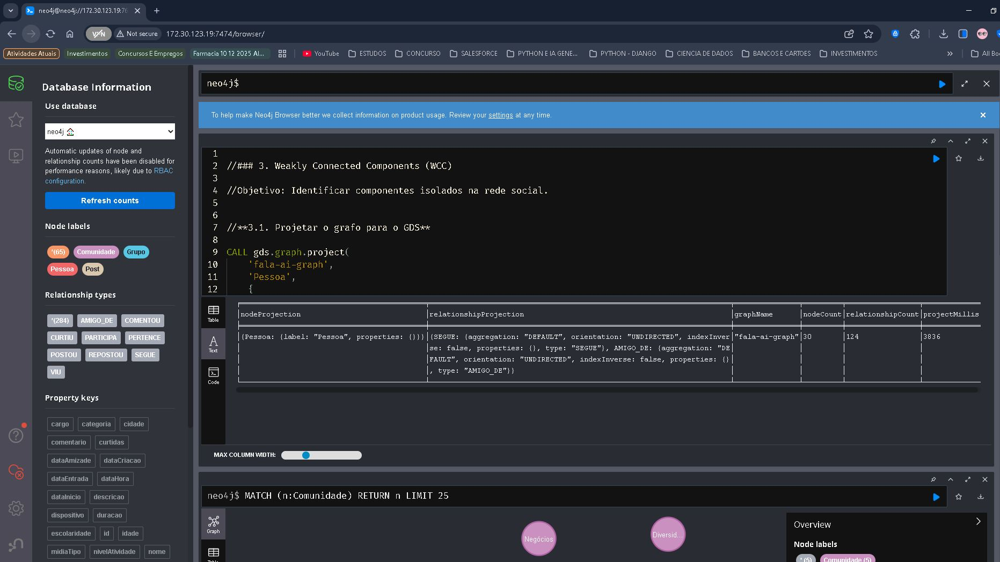

**3.2. Executar WCC e analisar componentes**

``` 
cypher

CALL gds.wcc.stats('fala-ai-graph')
YIELD componentCount, componentDistribution
RETURN componentCount AS total_componentes,
       componentDistribution.p99 AS percentil_99_tamanho;
``` 

**Resultado:**

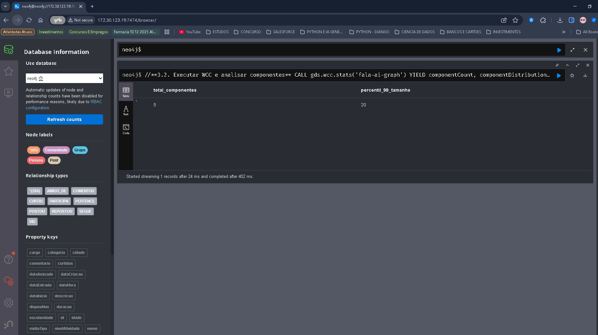

**3.3. Encontrar os maiores componentes**

``` 
cypher

CALL gds.wcc.stream('fala-ai-graph')
YIELD nodeId, componentId
WITH componentId, collect(gds.util.asNode(nodeId).nome) AS membros
RETURN componentId, size(membros) AS tamanho, membros[0..3] AS exemplos
ORDER BY tamanho DESC LIMIT 10;
``` 

### 4. PageRank (Influência)

Objetivo: Calcular a importância/influência de cada usuário na rede.

- **Executar PageRank na rede de seguidores**
``` 
cypher

CALL gds.pageRank.stream('fala-ai-graph')
YIELD nodeId, score
WITH gds.util.asNode(nodeId) AS pessoa, score
RETURN pessoa.nome AS usuario,
       score AS influencia,
       pessoa.profissao AS profissao,
       pessoa.idade AS idade
ORDER BY score DESC LIMIT 10;
Interpretação: Usuários com maior PageRank são aqueles que recebem muitos seguidores e também são seguidos por outros influenciadores.
``` 

**Resultado:**

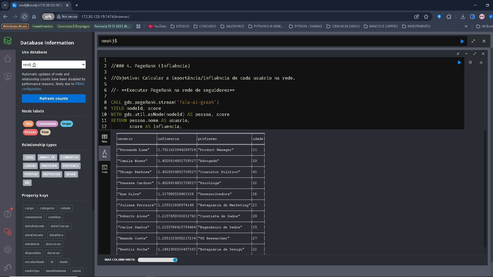


### 5. Community Detection (Louvain)**

Objetivo: Descobrir comunidades naturais baseadas em interações.

**Executar Louvain na rede de interações**
``` 
cypher

CALL gds.louvain.stream('fala-ai-graph', {
    relationshipTypes: ['SEGUE', 'AMIGO_DE']
})
YIELD nodeId, communityId
WITH communityId, collect(gds.util.asNode(nodeId).nome) AS membros
RETURN communityId, size(membros) AS tamanho, membros[0..5] AS exemplos
ORDER BY tamanho DESC LIMIT 5;
```

**Resultado:**

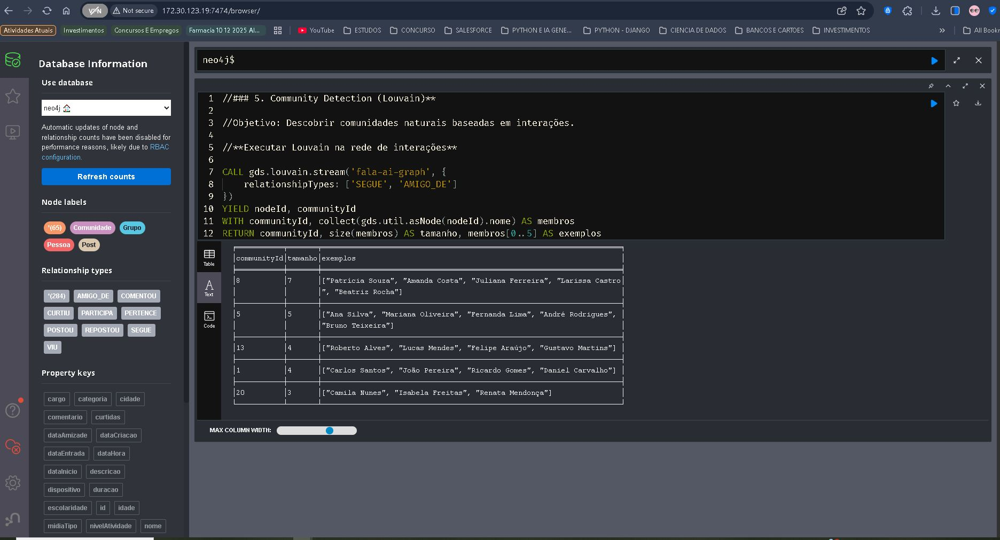


### 6. Shared Audience Analysis

Objetivo: Encontrar comunidades baseadas em audiência compartilhada (usuários que interagem com os mesmos posts).

**6.1. Projetar grafo de audiência compartilhada**

``` 
cypher

CALL gds.graph.project(
    'shared-audience',
    { Pessoa: { properties: 'idade', label: 'Pessoa' }, Post: {} },
    { CURTIU: { type: 'CURTIU', orientation: 'REVERSE' } }
);

```

**Resultado:**

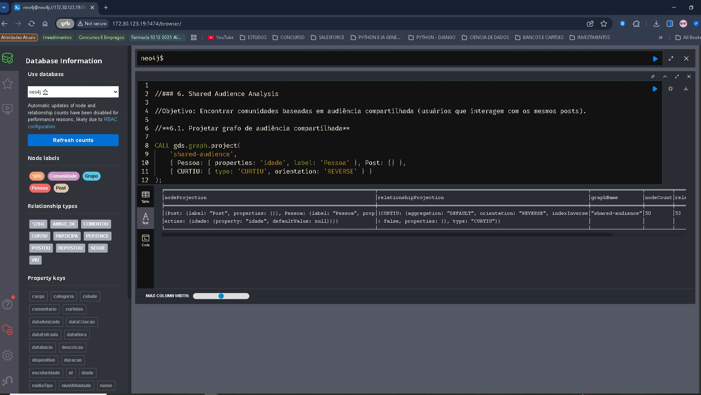


**6.2. Calcular similaridade entre usuários baseada em posts curtidos**

``` 
cypher

CALL gds.nodeSimilarity.stream('shared-audience', {
    nodeLabels: ['Pessoa'],
    similarityCutoff: 0.3,
    topK: 5
})
YIELD node1, node2, similarity
WHERE gds.util.asNode(node1).nome <> gds.util.asNode(node2).nome
RETURN gds.util.asNode(node1).nome AS usuario1,
       gds.util.asNode(node2).nome AS usuario2,
       similarity
ORDER BY similarity DESC LIMIT 20;
 

// 6.2 Alternativa Cypher puro.
// Análise de similaridade com Cypher puro

MATCH (p1:Pessoa)-[:CURTIU]->(post:Post)<-[:CURTIU]-(p2:Pessoa)
WHERE p1 <> p2
WITH p1, p2, COUNT(DISTINCT post) AS posts_comuns
WHERE posts_comuns > 0
WITH p1, p2, posts_comuns,
     COUNT{ (p1)-[:CURTIU]->() } AS total_curtidas_p1,
     COUNT{ (p2)-[:CURTIU]->() } AS total_curtidas_p2
RETURN p1.nome AS usuario1,
       p2.nome AS usuario2,
       posts_comuns AS posts_em_comum,
       total_curtidas_p1 AS curtidas_p1,
       total_curtidas_p2 AS curtidas_p2,
       toFloat(posts_comuns) / (total_curtidas_p1 + total_curtidas_p2 - posts_comuns) AS jaccard_similaridade
ORDER BY jaccard_similaridade DESC
LIMIT 20;
``` 

**Resultado:**

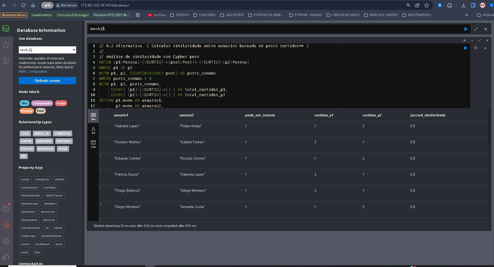


### 7. Análises de Caminho e Proximidade

Objetivo: Encontrar o menor caminho entre usuários.

**Caminho mais curto entre dois usuários específicos**

``` 
cypher

MATCH path = shortestPath(
    (a:Pessoa {nome: 'Daniel Carvalho'})-[*]-(b:Pessoa {nome: 'Felipe Araújo'})
)
RETURN length(path) AS distancia,
       [node IN nodes(path) | node.nome] AS caminho;
``` 

**Resultado:**

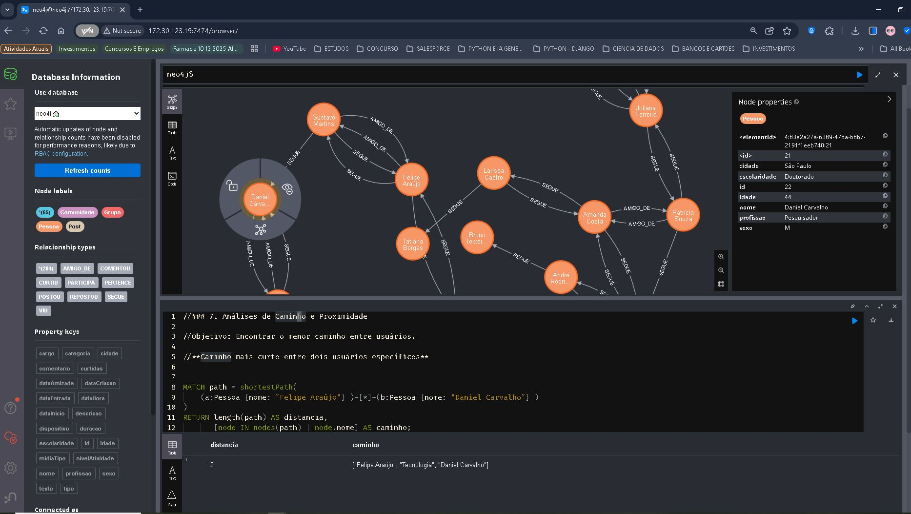


**Caminho mais curto baseado em tipo de relacionamento específico**

``` 
cypher

MATCH path = shortestPath(
    (a:Pessoa {nome: 'Tatiana Borges'})-[:AMIGO_DE*]-(b:Pessoa {nome: 'Lucas Mendes'})
)
RETURN length(path) AS distancia_amizade,
       [node IN nodes(path) | node.nome] AS caminho_amigos;

``` 

**Resultado:**

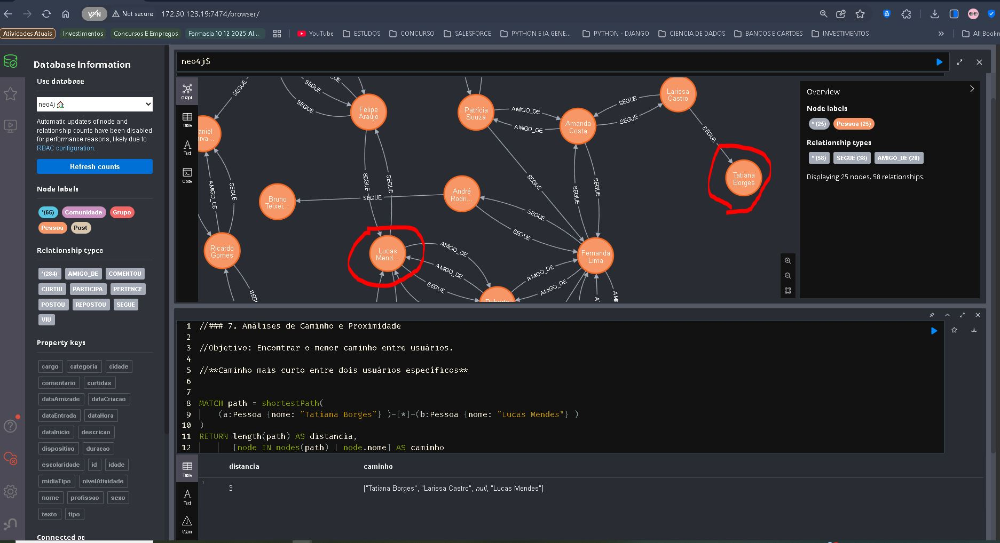


### 8. Algoritmo Node Similarity para Recomendações

Objetivo: Recomendar novos usuários para seguir baseado em similaridade.

**8.1. Projetar grafo para similaridade**
``` 
cypher

CALL gds.graph.project(
    'user-similarity',
    'Pessoa',
    {
        CURTIU: { type: 'CURTIU', orientation: 'UNDIRECTED' },
        SEGUE: { type: 'SEGUE', orientation: 'UNDIRECTED' }
    }
);
``` 

**Resultado:**

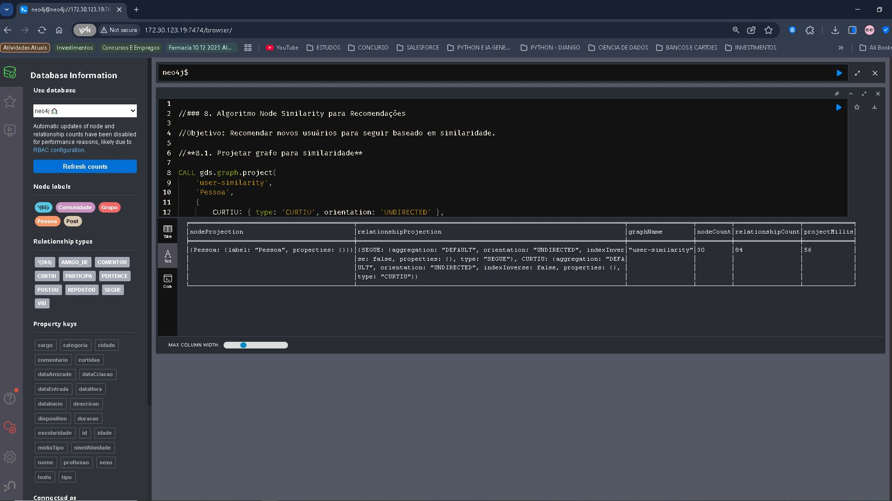


**8.2. Calcular similaridade entre usuários**
``` 
cypher

CALL gds.nodeSimilarity.stream('user-similarity', {
    topK: 10,
    similarityCutoff: 0.4
})
YIELD node1, node2, similarity
WHERE gds.util.asNode(node1).nome = 'Felipe Araújo'
RETURN gds.util.asNode(node2).nome AS recomendado,
       similarity AS pontuacao_similaridade
ORDER BY similarity DESC LIMIT 5;
``` 

**Resultado:**

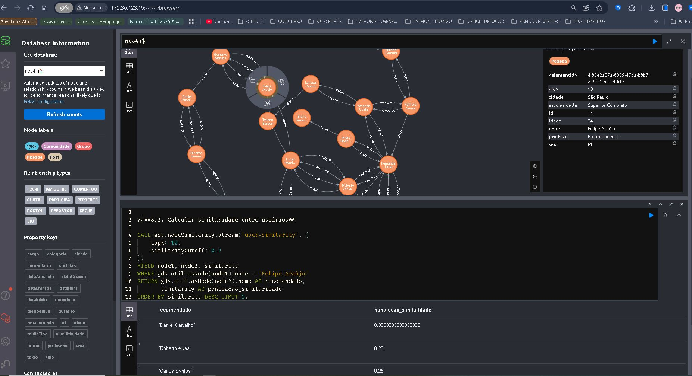


### 9. Critérios para Recomendação de Seguidores

Objetivo: Recomendar usuários com base em critérios demográficos e de interesse.

**Critério 9.1: Interesses similares (posts curtidos em comum)**
``` 
cypher

MATCH (p:Pessoa {nome: 'Fernanda Lima'})-[:CURTIU]->(post:Post)<-[:CURTIU]-(candidato:Pessoa)
WHERE NOT EXISTS( (p)-[:SEGUE]->(candidato) )
  AND p <> candidato
WITH candidato, COUNT(DISTINCT post) AS posts_comuns
RETURN candidato.nome AS recomendado,
       candidato.profissao AS profissao,
       posts_comuns
ORDER BY posts_comuns DESC LIMIT 5;
``` 

**Resultado:**

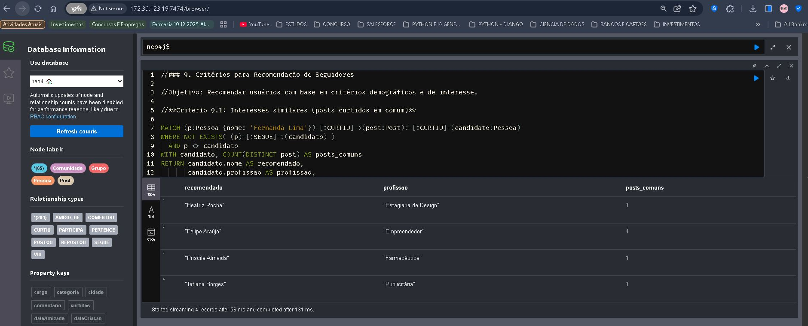


**Critério 9.2: Mesma faixa etária e sexo**
``` 
cypher

MATCH (p:Pessoa {nome: 'Fernanda Lima'})
MATCH (c:Pessoa)
WHERE p <> c
  AND NOT EXISTS( (p)-[:SEGUE]->(c) )
  AND c.idade BETWEEN p.idade - 5 AND p.idade + 5
  AND c.sexo = p.sexo
  AND c.cidade = p.cidade
RETURN c.nome AS recomendado,
       c.idade AS idade,
       c.profissao AS profissao
LIMIT 5;
``` 

**Resultado:**

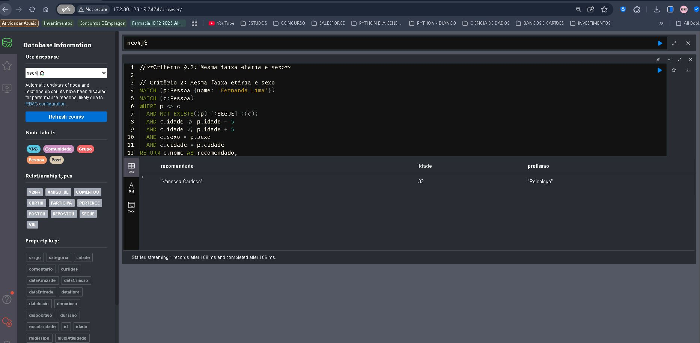


**Critério 9.3: Amigos em comum (amizade indireta)**

``` 
cypher

MATCH (p:Pessoa {nome: 'João Pereira'})-[:AMIGO_DE*2]-(c:Pessoa)
WHERE NOT EXISTS( (p)-[:AMIGO_DE]-(c) )
  AND p <> c
WITH c, COUNT(*) AS amigos_em_comum
RETURN c.nome AS recomendado,
       amigos_em_comum
ORDER BY amigos_em_comum DESC LIMIT 5;
``` 

**Resultado:**

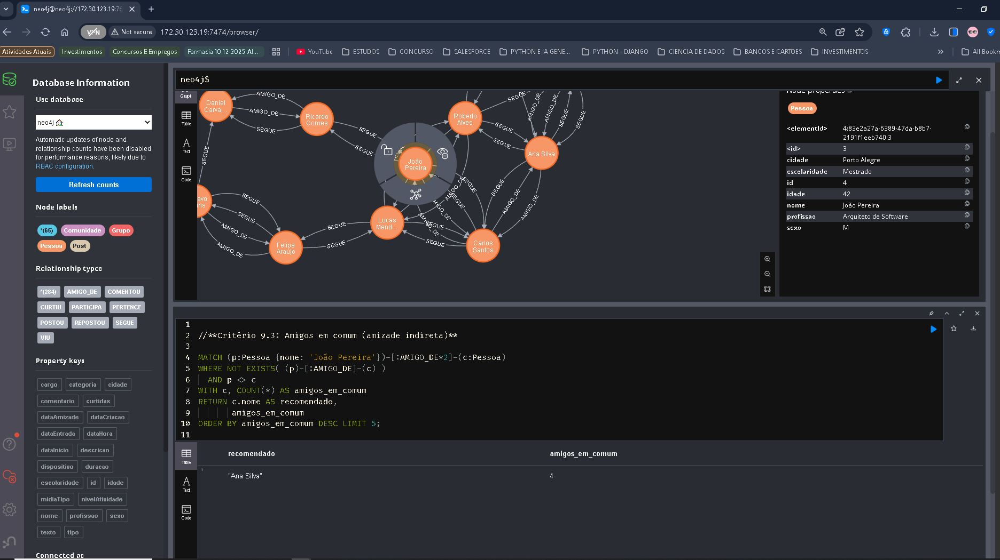


### 10. Análise de Público-Alvo por Grupo/Comunidade

Objetivo: Caracterizar demograficamente os membros de grupos e comunidades.

**Análise do público de um grupo específico**
``` 
cypher

MATCH (g:Grupo {nome: 'Tecnologia'})<-[:PERTENCE]-(p:Pessoa)
RETURN 
    AVG(p.idade) AS idade_media,
    COUNT(CASE WHEN p.sexo = 'M' THEN 1 END) AS homens,
    COUNT(CASE WHEN p.sexo = 'F' THEN 1 END) AS mulheres,
    COLLECT(DISTINCT p.profissao)[0..5] AS profissoes_comuns,
    p.cidade AS cidade_mais_comum
ORDER BY COUNT(*) DESC;
``` 

**Resultado:**

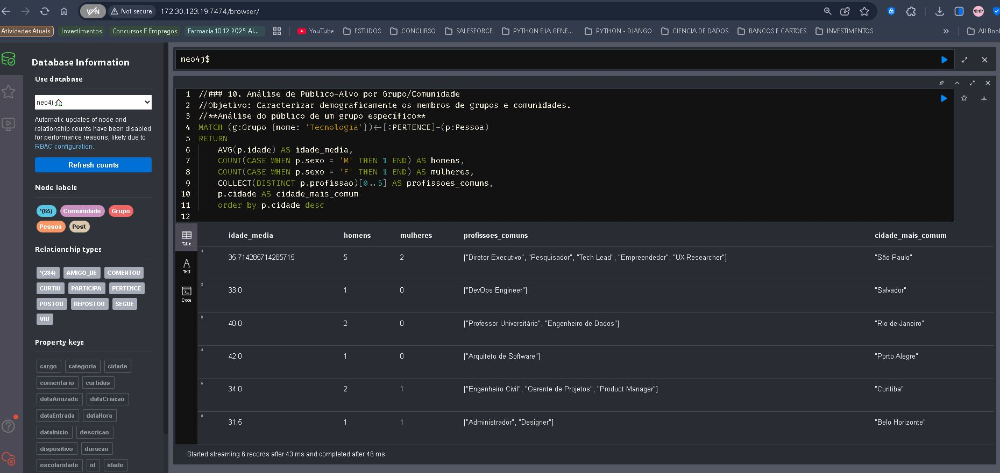


---

## 📈 Análise das Técnicas Utilizadas

### Comparativo de Algoritmos

| Técnica | Objetivo | Performance | Aplicação no Projeto |
|---------|----------|-------------|----------------------|
| PageRank | Medir influência | ⚡⚡⚡ Rápida | Identificar líderes de opinião |
| Louvain | Detectar comunidades | ⚡⚡ Média | Agrupar usuários com interesses similares |
| Node Similarity | Recomendar conexões | ⚡⚡ Média | "Quem seguir" baseado em interesses |
| WCC | Identificar componentes | ⚡⚡⚡⚡ Muito rápida | Detectar grupos isolados na rede |
| Shortest Path | Calcular distância social | ⚡⚡ Média | Encontrar conexões indiretas |


## 🛠️ Tecnologias Utilizadas

| Tecnologia | Versão | Finalidade |
|------------|--------|------------|
| Neo4j | 5.x | Banco de dados de grafos principal |
| Cypher | - | Linguagem de consulta |
| APOC | 5.x | Procedimentos auxiliares (estatísticas, utilidades) |
| Graph Data Science (GDS) | 2.x | Algoritmos de grafos avançados |
| Docker | - | Instanciando o banco local para poder usar a biblioteca GDS |


## 📂 Estrutura do Repositório

    fala-ai-graph/
    ├── README.md                 # Este arquivo
    ├── /docs
    ├── /scripts
    │   ├── 01_criacao_banco.cypher
    │   ├── 02_analise_queries.cypher
    │   └── 03_analises_completas.cypher
    ├── /imagens
    ├── /data
    └── /old

---

## 🐛 Troubleshooting e Dicas


### Problemas Comuns e Soluções


- **Erro ao executar algoritmos GDS**

- -     Verifique se o plugin Graph Data Science está instalado

- -     Execute CALL gds.list() para confirmar disponibilidade

- -     No meu caso, como eu nao tenho o Neo4J Desktop e ainda estou na versao free do banco, tive que:
- - -       Criar uma imagem do Neo4J via docker
- - -       Importar o banco para o ambiente

- -     E testar os itens 03 a 08  do arquivo 03_analiises_completas.cypher, nesta opção do docker... Ufa da tabalho.

- -     Problema para executar a analise 6.2 (  arquivo 03_analiises_completas.cypher) , o unico jeito que encontrei foi usar uma query cypher para trazer os dados.

- **Projeção de grafo não encontrada**

- -     Execute CALL gds.graph.list() para ver projeções existentes

- -     Recrie a projeção se necessário


- **Performance lenta em grafos grandes**

- -     Use :auto e IN TRANSACTIONS para cargas grandes

- -    Crie índices apropriados (CREATE INDEX)

## 🔄 Próximos Passos

-  Adicionar mais propriedades para análise de sentimento

-  Aprofundar mais conhecimento sobre GDS 

---

## 👨‍💻 Desenvolvedor
<p>&nbsp&nbsp&nbspAlvaro Monteiro<br>
    &nbsp&nbsp&nbsp
    <a href="https://github.com/Alvaro-MSJR">
    GitHub</a>&nbsp;|&nbsp;
    <a href="www.linkedin.com/in/alvaro-monteiro-silva">LinkedIn</a>
&nbsp;|&nbsp;</p>

---

### 📢 Notas sobre a Criação do Projeto

Este trabalho foi desenvolvido com o apoio de IA Generativa, usei tanto DeepSeek quanto GeminiAI para desenvolvimento do estudo e criação do projeto.

Uso da IA ajuda muito na velocidade da construção, porém o conhecimento ainda é humano.

---

### 🤝 Contribuições

Contribuições são bem-vindas! Sinta-se à vontade para abrir uma issue ou um pull request.


## ✨ Agradecimentos

-  A DEUS, sobre todas as coisas.

-  Minha família e amigos.

-  Comunidade Neo4j pelo suporte e documentação

-  Equipe da DIO pelo desafio e mentoria

-  Contribuidores do projeto Twitch Graph Examples pela inspiração

-  E a todos os entusiastas de Ciência de Dados que compartilham conhecimento e tornam projetos como este possíveis.

### ***Desenvolvido como parte do desafio de Banco de Dados em Grafos com Neo4j**
### **"Fala Ai" - Conectando pessoas através de grafos 🚀**

Muito obrigado pela atenção!